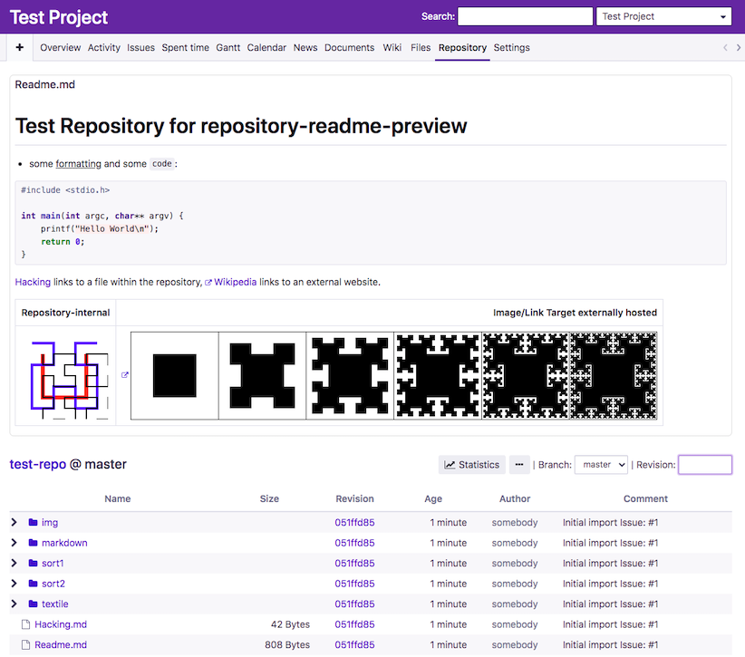

# Redmine Repository Readme Preview Plugin
Inline previews of Readme files in the [Redmine](https://redmine.org/) repository browser.

This plugin shows inline previews of Readme files when browsing directories in the Redmine repository view (similarly to Github/Gitlab/...). It uses the built-in Redmine renderers for Textile (`*.textile`) and Markdown (`*.md`, `*.markdown`) files. For files without an extension and or with the extensions `.txt` or `.rdoc`, the plugin provides a plain text preview.

Besides images with external URLs, the plugin also supports images stored in the same repository. Additionally, links to files in the same repository are supported although they point to the default Redmine repository view for individual files, which - as of 4.1 - does not provide preview rendering.

The plugin is intentionally minimal and does not provide any configuration options nor use the database and has no dependencies.

[](docs/preview.png "Screenshot (using PurpleMine2 theme)")


## Requirements
The plugin has been tested on Redmine 3.3 and 4.1 but should work on versions in between and may work on earlier or later versions as well. It requires Ruby 2.0 or newer.


## Installation
The [general plugin installation instructions](https://www.redmine.org/projects/redmine/wiki/Plugins) apply as this plugin does not require any special handling and does not use the database.

Clone this repository to `repository_readme_preview` in the `plugins` directory of the Redmine installation (the local directory name _is_ important).

In short, execute the following from the Redmine root directory:
```shell script
git clone https://github.com/isotes/redmine-repository-readme-preview plugins/repository_readme_preview
bundle install
bundle exec rake redmine:plugins RAILS_ENV=production
```

## Styling
In the HTML page, the preview is wrapped in a div container with the `repository-readme-preview` CSS class, which can be used to override the styling in custom themes.


## License
[MIT](LICENSE)
