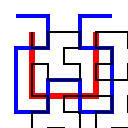

# Test Repository for repository-readme-preview

* some _formatting_ and some `code`:

```C
#include <stdio.h>

int main(int argc, char** argv) {
	printf("Hello World\n");
	return 0;
}
```

[Hacking](Hacking.md) links to a file within the repository, [Wikipedia](https://wikipedia.org) links to an external website.


1. Internal image, internal link, with title

[](../img/hilbert.svg "Internal Hilbert Curve")


2. Internal image, external link, with title

[](https://commons.wikimedia.org/wiki/File:Hilbert_curve_2.svg "Internal Hilbert Curve")


3. Internal image, no link, with title


4. Internal image, no link, no title


5. External image, internal link, with title

[](../Hacking.md "External T-Square")

6. External image, external link, with title

[](https://upload.wikimedia.org/wikipedia/commons/c/cb/T-Square_fractal_%28evolution%29.png "External T-Square")

7. External image, no link, with title


8. External image, no link, no title


## Subheader

| Left aligned  | Center alignment  | Right alignment |
| ------------- |:-----------------:| ---------------:|
| Left          | Center            | Right           |

